# prelimactivitynumber3-donotincludeanycode-divina1017
prelimactivitynumber3-donotincludeanycode-divina1017 created by GitHub Classroom

Missing is the codes for Statistical Algorithm and Matrix Operations
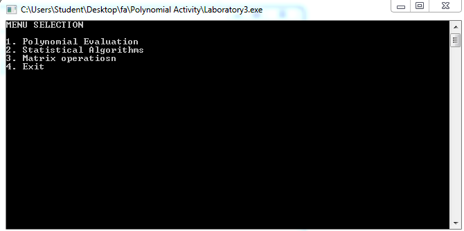
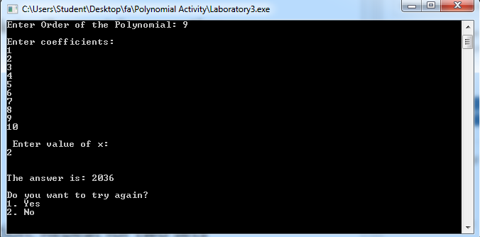
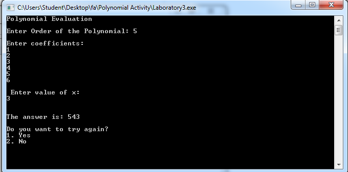
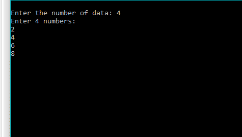
\n

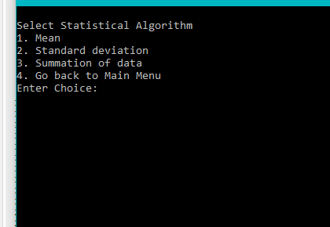
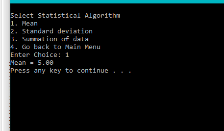
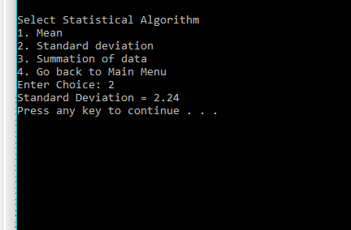
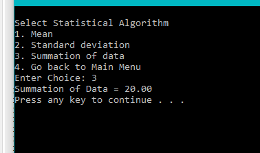
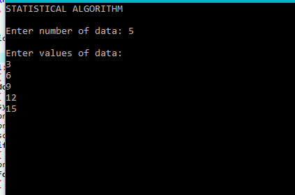
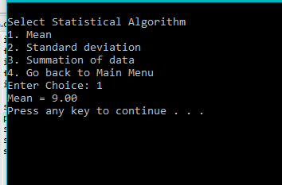
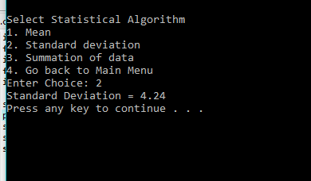
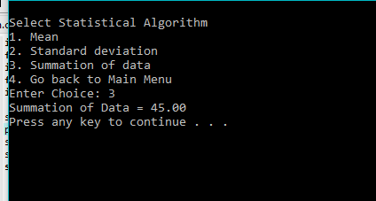
